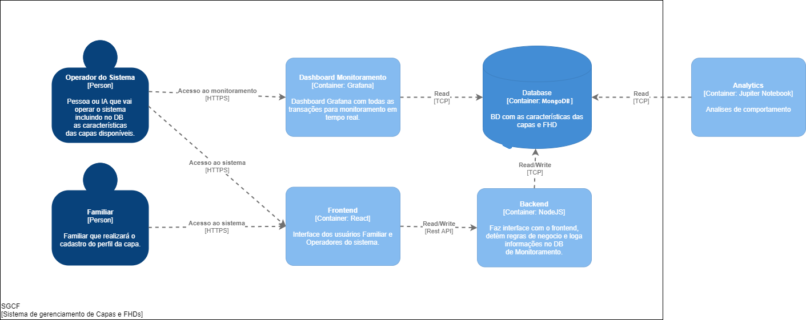

# hero-api

Esta api é reponsavel pela listagem, criação, alteração e exclusão de capas que são oferecidas pela hero.

## Solução

Sistema de cadastro de pessoas que foram desencapadas por qualquer motivo possam encontrar um corpo semelhante ao antigo.

## Persona

* Nome: Isabela
* Idade: 18 anos
* Planeta: Terra
* Lugar de moradia: Bay City
* Ano: 2384
* Morreu em um acidente de carro
* Precisa de um rencapamento e existem poucas opções de no seu perfil de idade.
* As autoridades querem dar uma capa de uma mulher mais velha e etinia diferente.
* Sua familia está desconfortavél com esta situação e os traumas que ela pode ter e o tempo que ela levaria para se recuperar.

## MVC

### Alunos

* RM86499 - Alexandre Evangelista do Nascimento
* RM83872 - Ana carolina Lakitini dos Santos
* RM76593 - Jonatas Alves de Oliveira
* RM83830 - Karoline Santato Cavanha
* RM82359 - Victoria Calixto Maciel